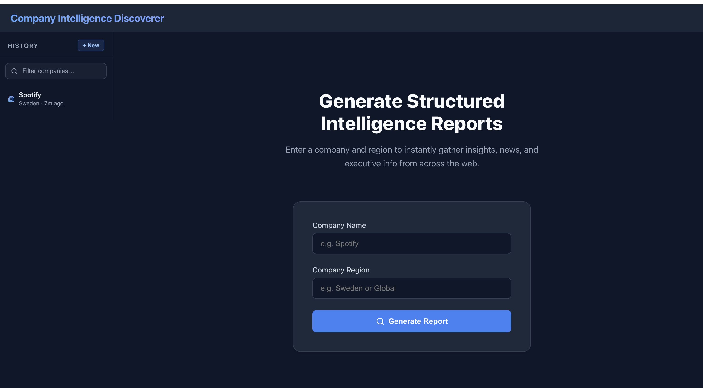
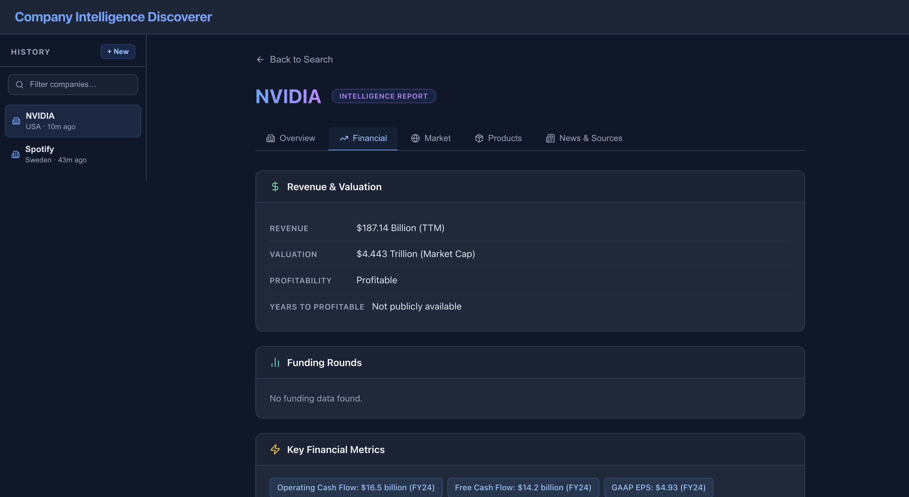

# Company Discoverer

> AI-powered company intelligence reports — search any company, get a structured deep-dive in seconds.

## Overview

**Company Discoverer** is a full-stack application that generates structured intelligence reports about any company based on its name and region of operation. It retrieves publicly available information via web search and page scraping, processes it through a **LangGraph multi-agent pipeline**, and returns a rich, tabbed business analysis.

## Search



Enter any company name and country/region to kick off an analysis. Previous searches are accessible in the left sidebar, so you can switch between reports instantly without re-generating them.

## Report



Each report is broken down into five specialised tabs, each backed by a dedicated parallel AI agent:

| Tab | What it covers |
|-----|---------------|
| **Overview** | Executive summary, year founded, key leadership |
| **Financial** | Revenue, valuation, funding rounds, years to profitability |
| **Market** | Market segment, geography, competitors, strategic moves |
| **Products** | Core products/services, tech stack, pricing model |
| **News & Sources** | Recent milestones and all source URLs |

---

## Architecture

```
POST /api/generate-report
        │
        ▼
  ┌─────────────┐
  │ Router Node │  validates company / region input
  └──────┬──────┘
         │ (parallel fan-out)
  ┌──────┴───────────────────────────────────────┐
  │              │                │              │
  ▼              ▼                ▼              │
Financial      Market           Product          │
  Node           Node             Node           │
  │              │                │              │
  ▼              │                │              │
Financial      │                │              │
Deep Node      │                │              │
  │              │                │              │
  └──────────────┴────────────────┘              │
         │ (converge)                            │
         ▼                                       │
   Report Node  ◄────────────────────────────────┘
         │
         ▼
  Qdrant (saved for history)
```

- **LangGraph multi-agent pipeline**:
  - **Router**: Validates input before starting research.
  - **Financial**: Extracts baseline financials (revenue, valuation).
  - **Financial Deep-Dive**: Sequential node that uses financial data to drill into investor rationale, capital deployment, and future outlook.
  - **Market Positioning**: Analyzes competition and geographic presence.
  - **Product Intelligence**: Details core products and technology stack.
- **Report node** assembles all sub-models into a final `StructuredBusinessAnalysis`.
- Every generated report is **persisted to Qdrant** for instant recall in the sidebar.

---

## Tech Stack

| Layer | Technology |
|-------|------------|
| Backend | FastAPI, LangGraph, LangChain, OpenAI GPT-4o-mini |
| Search | DuckDuckGo (`ddgs`) |
| Scraping | `httpx` + BeautifulSoup4 |
| Vector DB | Qdrant + `sentence-transformers` (all-MiniLM-L6-v2) |
| Frontend | React, Lucide Icons |
| Infra | Docker Compose |

---

## Running Locally

### Prerequisites
- Docker & Docker Compose
- An OpenAI API key

### Setup

1. Clone the repository:
   ```bash
   git clone https://github.com/your-org/company_discoverer.git
   cd company_discoverer
   ```

2. Create `backend/.env`:
   ```env
   OPENAI_KEY=sk-...
   ```

3. Start all services:
   ```bash
   docker compose up --build
   ```

4. Open [http://localhost:3000](http://localhost:3000)

### Services

| Service | URL |
|---------|-----|
| Frontend (React) | http://localhost:3000 |
| Backend (FastAPI) | http://localhost:8000 |
| Qdrant UI | http://localhost:6333/dashboard |

---

## API Reference

| Method | Endpoint | Description |
|--------|----------|-------------|
| `POST` | `/api/generate-report` | Generate a new intelligence report |
| `GET` | `/api/reports` | List all saved reports (sidebar data) |
| `GET` | `/api/reports/{id}` | Fetch a full report by UUID |
| `DELETE` | `/api/reports/{id}` | Delete a saved report |
